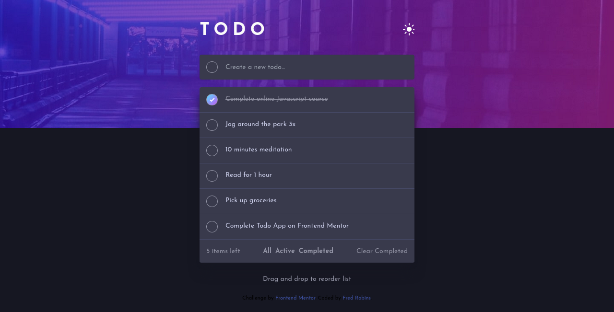

# Frontend Mentor - Todo app solution

This is a solution to the [Todo app challenge on Frontend Mentor](https://www.frontendmentor.io/challenges/todo-app-Su1_KokOW). Frontend Mentor challenges help you improve your coding skills by building realistic projects. 

## Table of contents

- [Frontend Mentor - Todo app solution](#frontend-mentor---todo-app-solution)
  - [Table of contents](#table-of-contents)
  - [Overview](#overview)
    - [The challenge](#the-challenge)
    - [Screenshot](#screenshot)
    - [Links](#links)
  - [My process](#my-process)
    - [Built with](#built-with)
    - [What I learned](#what-i-learned)
    - [Useful resources](#useful-resources)
  - [Author](#author)
  - [Acknowledgments](#acknowledgments)

**Note: Delete this note and update the table of contents based on what sections you keep.**

## Overview

### The challenge

Users should be able to:

- View the optimal layout for the app depending on their device's screen size
- See hover states for all interactive elements on the page
- Add new todos to the list
- Mark todos as complete
- Delete todos from the list
- Filter by all/active/complete todos
- Clear all completed todos
- Toggle light and dark mode
- **Bonus**: Drag and drop to reorder items on the list

### Screenshot



### Links

- Solution URL: [Add solution URL here](https://your-solution-url.com)
- Live Site URL: [Add live site URL here](https://your-live-site-url.com)

## My process

### Built with

- Semantic HTML5 markup
- Flexbox
- Mobile-first workflow
- Tailwind CSS


### What I learned

I learned Tailwind CSS and I used it for the first time and it was really fun, writing CSS this way is maybe easier and also very helpful with the Js, instead of writing code to change an element from one state to the other, you can just toggle between classes and that saves you some time and thinking...

It's easier to do this than to think hard about a classname for this element and also worrying about best and meaningful naming conventions. This is a better way.
```html
<h2 class="mx-auto text-dark-grayish-blue dark:text-dark-grayish-blue">Drag and drop to reorder list</h2>
```

### Useful resources

- [Tailwind CSS](https://www.tailwindcss.com) - The official docs helped me so much, it was easy to understand and I recommend it to anyone who wants to write CSS - the fast and the Tailwind way.

## Author

- Website - [Fred Robins](https://github.com/ZenitsuAg)
- Frontend Mentor - [@ZenitsuAg](https://www.frontendmentor.io/profile/ZenitsuAg)

## Acknowledgments

- I give thanks to you, God Almighty for your grace and continuous support. Without you Lord Jesus, I wouldn't have come this far.